# GitHub Actions Workflows

This directory contains automated workflows for the Giizhendam Aabajichiganan MCP project.

## Workflows Overview

### 1. `npm-publish.yml` - Automated npm Publishing 📦

**Purpose:** Automatically publish new versions to npm when releases are created.

**Triggers:**
- When a GitHub release is created
- Manual dispatch with version input

**What it does:**
1. Checks out the repository
2. Sets up Node.js and npm
3. Installs dependencies and builds the package
4. Verifies package contents (agents directory, dist files)
5. Checks if version is already published (prevents duplicate publishes)
6. Publishes to npm (if new version)
7. Verifies publication succeeded
8. Tests installation via npx
9. Creates GitHub release (if triggered by release event)

**Required Secrets:**
- `NPM_TOKEN` - npm authentication token with publish permissions

**Setup:**
1. Create an npm access token at https://www.npmjs.com/settings/YOUR_USERNAME/tokens
2. Add it as a secret named `NPM_TOKEN` in GitHub repository settings
3. Ensure the token has "Automation" type for CI/CD use

**Usage:**
```bash
# Option 1: Create a GitHub release
gh release create v0.6.0 --title "Release v0.6.0" --notes "See CHANGELOG.md"

# Option 2: Manual dispatch via GitHub UI
# Actions → npm-publish → Run workflow → Enter version
```

### 2. `detect-secrets.yml` - Secret Detection & Blocking 🚨

**Purpose:** Prevents secrets from being committed to the repository.

**Triggers:**
- On every push to main/dev/staging
- On every pull request

**What it does:**
1. Uses TruffleHog OSS to scan for verified secrets
2. Uses Gitleaks for pattern-based detection
3. Scans for specific patterns (API keys, local paths)
4. **BLOCKS** the PR/push if secrets are found
5. Comments on PR with remediation steps

**Detected Patterns:**
- Brave API keys (`BSA...`)
- Tavily API keys (`tvly-dev-...`)
- OpenRouter API keys (`sk-or-v1-...`)
- Local paths (`/Volumes/1tb-sandisk/`, `/Users/...`)
- Generic API key patterns

**No setup required** - works out of the box.

### 3. `auto-sanitize.yml` - Automatic Secret Removal 🧹

**Purpose:** Automatically removes secrets from CONFIGURATIONS files before they're merged.

**Triggers:**
- On push to main/dev/staging when CONFIGURATIONS files change
- On pull requests when CONFIGURATIONS files change

**What it does:**
1. Finds all `settings.json` files in CONFIGURATIONS directory
2. Sanitizes API keys and local paths using jq
3. Commits sanitized files back to the branch
4. Comments on PR when secrets were found and cleaned

**Sanitized Values:**
- `BRAVE_API_KEY` → `YOUR_BRAVE_API_KEY_HERE`
- `TAVILY_API_KEY` → `YOUR_TAVILY_API_KEY_HERE`
- `OPENROUTER_API_KEY` → `YOUR_OPENROUTER_API_KEY_HERE`
- Local paths → `/path/to/your/mcp/servers`

**Required Permissions:**
- Repository Settings → Actions → General
- Workflow permissions: "Read and write permissions"
- ✅ Allow GitHub Actions to create and approve pull requests

### 4. `secret-scan.yml` - Legacy (Disabled) 🔒

Original scanning workflow. Kept for reference but only runs on manual trigger.

## Workflow Dependencies

```mermaid
graph TD
    A[Push/PR] --> B[detect-secrets.yml]
    B -->|Secrets Found| C[❌ Block PR]
    B -->|No Secrets| D[✅ Continue]
    
    A --> E{CONFIGURATIONS changed?}
    E -->|Yes| F[auto-sanitize.yml]
    F -->|Secrets Found| G[🧹 Auto-Clean & Commit]
    F -->|No Secrets| H[✅ Nothing to do]
    
    I[Release Created] --> J[npm-publish.yml]
    J --> K[📦 Publish to npm]
```



## Setup Checklist

### For npm Publishing

- [ ] Create npm access token (Automation type)
- [ ] Add `NPM_TOKEN` secret to GitHub repository
- [ ] Test workflow with manual dispatch
- [ ] Verify package appears on npm after publish

### For Secret Protection

- [ ] Enable Actions write permissions (Settings → Actions → General)
- [ ] Allow Actions to create/approve PRs
- [ ] Test by pushing a file with a test secret
- [ ] Verify auto-sanitization works
- [ ] Verify detection blocks PRs

## Testing Workflows

### Test npm-publish.yml

```bash
# Create a test release
gh release create v0.6.0-test --title "Test Release" --notes "Testing"

# Or use manual dispatch in GitHub UI
```

### Test detect-secrets.yml

```bash
# This should be blocked
echo '{"OPENROUTER_API_KEY": "sk-or-v1-test123456789012345678901234567890123456789012345678901234567890"}' > CONFIGURATIONS/test.json
git add CONFIGURATIONS/test.json
git commit -m "test: trigger secret detection"
git push

# Check Actions tab - should see ❌ failure
```

### Test auto-sanitize.yml

```bash
# Add a secret to CONFIGURATIONS
echo '{"OPENROUTER_API_KEY": "sk-or-v1-test123456789012345678901234567890123456789012345678901234567890"}' > CONFIGURATIONS/MCP/test.json
git add CONFIGURATIONS/
git commit -m "test: trigger auto-sanitize"
git push

# Check Actions tab - should auto-clean and commit
```

## Troubleshooting

### npm-publish.yml

**Issue: "NPM_TOKEN not found"**
- Solution: Add `NPM_TOKEN` secret in repository settings

**Issue: "Version already published"**
- Solution: Bump version in package.json before creating release

**Issue: "Package verification failed"**
- Solution: Ensure `agents` directory exists and contains .md files

### detect-secrets.yml

**Issue: "Too many false positives"**
- Solution: Adjust patterns in the workflow file

**Issue: "Not detecting secrets"**
- Solution: Check that patterns match your secret format

### auto-sanitize.yml

**Issue: "Permission denied"**
- Solution: Enable write permissions in repository settings

**Issue: "Auto-commit not working"**
- Solution: Check branch protection rules allow Actions to push

## Best Practices

1. ✅ **Always test workflows** before relying on them
2. ✅ **Use npm-publish.yml** for consistent releases
3. ✅ **Keep secrets out of code** - use environment variables
4. ✅ **Review auto-sanitized commits** before merging
5. ✅ **Rotate exposed keys** immediately if secrets leak

## Security Notes

⚠️ **Important:**
- GitHub Actions have access to your secrets
- Auto-sanitization runs **after** the push (secrets briefly exist in history)
- For maximum security, use `git-secrets` locally to prevent pushes
- These workflows are **defense in depth**, not primary protection
